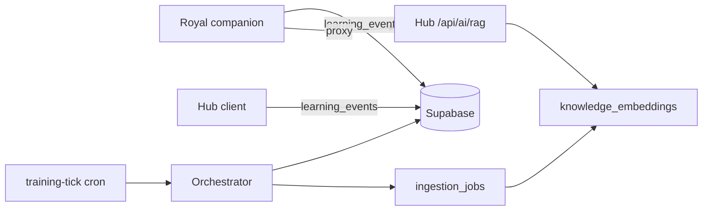

# Kus Training Plane

Continuous learning **without fine-tuning base model weights**. Hub and Royal companion share one Supabase memory layer; a background orchestrator turns signals into verified vector chunks.

## Three layers

| Layer | Repo | Role |
|-------|------|------|
| **Presentation** | `kus-ai-app`, Hub UI | Chat, agents picker (user-facing only) |
| **Inference** | Hub `sport-clan-nexus` | `/api/ai/rag` + retrieval from pgvector |
| **Learning** | This repo + Hub workers | Harvest → gate → embed → store |

## Data flow



## Companion (this repo) — implemented

- `POST /api/learning/event` — authenticated event ingest
- `GET /api/cron/training-tick` — processes batch (Vercel cron every 30m)
- Chat 👍/👎 → `correction` / `helpful` events
- Retrieval miss heuristic after weak RAG answers
- RAG errors → `rag_error` events
- Settings → **Help improve Royal** toggle (`contributeToLearning`)

## Supabase setup

Run migration:

```bash
# supabase/migrations/001_training_plane.sql
```

Create storage buckets: `knowledge-raw`, `knowledge-normalized`.

Required env:

```
SUPABASE_SERVICE_ROLE_KEY=   # cron + worker only (never client)
CRON_SECRET=                 # Vercel cron auth
```

## Hub — to implement next

1. Emit `learning_events` with `source: 'hub'` on retrieval miss
2. Query `knowledge_embeddings` + `golden_qa_pairs` in `/api/ai/rag`
3. Full harvester/scout/gatekeeper/embedder (replace orchestrator stubs)
4. Do **not** expose internal agents in user agent picker

## Event types

| Type | Source | Orchestrator action |
|------|--------|---------------------|
| `retrieval_miss` | Both | Queue `auto-search-scout` job |
| `correction` | User 👎 | Queue `fact-checker-style` job |
| `helpful` | User 👍 | Insert `golden_qa_pairs` |
| `rag_error` | Companion | Logged (monitoring) |
| `harvest_request` | Admin/ad-hoc | Queue `data-harvester` job |

## Self-correction

`correction_events` links user feedback → gatekeeper re-processes → downrank or quarantine bad chunks (Hub worker).

## Why no weight training

Updating pgvector + golden Q&A gives instant knowledge and style without model collapse. Optional future: per-domain LoRA adapters stored in Supabase, loaded at Hub inference time.
